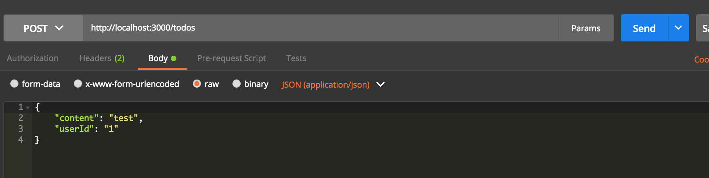

# node-restify-example


## restify란?

- 오로지 Restful API를 만들기 위한 Node.js module이다.
- Node.js에서 유명한 Express module에서도 Restful API를 지원하지만,
웹 서버기 때문에, RestFul API를 제외한 View단도 지원하므로, 단지 Restful API만을 위해서는 사용하기에 무겁다.

## restify 서버를 실행시켜보자.

- 기본적으로 Node.js와 Atom이 컴퓨터 설치되어 있다는 가정하에 진행한다.
  우리는 아무것도 없는 상태에서 API 서버 아키텍쳐를 설계하고 만들 것이다.

- Desktop 경로에 node-restify-example 이라는 폴더를 생성한다.

- 콘솔에서 해당 폴더로 들어가서 `npm init`을 쳐준다

```terminal

Mac :
 - ls : 현재 디렉토리에 있는 파일들을 보여준다
 - cd : cd 폴더명 을 입력하면 해당 폴더로 들어갈 수 있다.
        cd .. 을 입력하면 현재 폴더에서 상위 폴더로 나갈 수 있다.

Window:
  - dir : 현재 디렉토리에 있는 파일들을 보여준다
  - cd : cd 폴더명을 입력하면 해당 폴더로 들어갈 수 있다.
          cd .. 을 입력하면 현재 폴더에서 상위 폴더로 나갈 수 있다.          
```

- npm init 명령어를 치게되면 해당 디렉토리에 `package.json` 파일이 생성된다.
  그후 완료될 때까지, 엔터만 눌러준다.

- `package.json`이 생성되면 아래 링크에 접속하여 모든 디펜던시를 복사한다. 원래는 npm install --save 등의 명령어로 하나하나씩 해주어야 하지만, 그러려면 혈압(?)이 오를 수 있으니까 미리 완성된 코드에서 디펜던시를 가져 오도록 하자.

```
https://github.com/kind0518/node-restify-example/blob/master/package.json
```  

- package.json 파일을 복사 붙여넣기 했다면, 해당 디렉토리 (/node-resify-example)에서 `npm install`을 하면 모든 디펜던시 모듈 라이브러리들이 로드된다.

- config.js라는 파일을 생성한 후, 아래대로 따라 코딩한다.

```javascript
/*
(information)

- javascript에서 module은 관련된 코드들을 하나의 코드 단위로 캡슐화 할때 사용된다.
- 위와 같은 module은 다른 js파일에서 사용될 수 있어야 재사용되고, 활용도가 높아질 수 있다.
  그러기 위해서, module.exports를 사용하는데, 이는 다른 파일에서 import하기 위한 선언이라고
  이해하면 된다.
- 아래 코드는 config module을 만든것인데,
*/

module.exports = {
	name:'API',
	env: process.env.NODE_ENV || 'development',
	port: process.env.PORT || 3000,
	base_url: process.env.BASE_URL || 'http://localhost:3000'
};
```

- terminal을 열고, 해당 디렉토리 경로에서 `sudo npm install restify --save`를 입력한다.
  이는 npm으로부터 모듈을 다운로드 받게 해주고, --save는 package.json 파일에 dependencies를 자동으로 추가해준다.

- `app.js`라는 파일을 만들어 준다. 해당 파일 안에 아래와 같이 코딩한다. `app.js`는 앱 그 자체로서, 모든 코드가 모이고, 실행되는 객체이다.

```javascript
/*
(information)
- require는 다른 파일에 있는 module을 불러오게 도와준다.
*/
var restify = require('restify');
var config = require('./config.js');

const server = restify.createServer({
	name: config.name,
	version: config.version,
});

server.listen(config.port, () => {
  console.log("server start!");
  console.log("port : %d", config.port);
});

```

- terminal에서 해당 디렉토리 경로에서 아래와 같은 명령어를 쳤을 때, 터미널에 `server start` 가 나오면
  서버가 정상적으로 해당 포트에 boot up되었다는 것을 알 수 있다.

```terminal
  node app.js

  //node engine으로 app.js를 run 시키는 것이다.
```

- 위에 작업을 통해서 app이 정상적으로 3000번 포트에 물린것을 확인했다
  다시 Atom으로 와서 이번에는 `routes` 라는 디렉토리를 생성한다.

- routes 밑에 `createTodoRoute.js` 라는 파일을 생성한다. 경로는 `routes/createTodoRoute.js`가 될 것이다.

- 이제 test를 위한 모듈을 추가할 것이다. 우리가 사용할 모듈은 `mocha`이다.

```
  mac : sudo npm install mocha --save
  window : npm install mocha -- save (관리자 모드로 명령프롬포트 실행)
```

- package.json에 해당 스크립트를 추가한다.

```javascript
"scripts": {
  "test": "node_modules/.bin/mocha $(find ./test -name '*.js') --recursive -w"
}
```
위에 스크립트는 `mocha` test를 실행할 때 사용되는 스크립트이다. 위에 -w 옵션은 watcher 옵션으로
테스트가 변경되면 즉각적으로 테스트 성공? 실패?에 대해서 모니터링이 가능하다.

- test 라는 폴더를 생성한다 (`node-resify-example/test`).
그 후, test 폴더에 test1.js라는 파일을 만들어 간단한 테스트를 진행해보자.

```javascript
var assert = require('assert')

describe('Test suit', function(){
  it('should be ok', function() {
      assert.equal(1, 2);
  });
});
```

mocha 테스트는 `describe` 함수의 첫번째에 테스트를 할 대상 주어를 작성하고, 그리고 it에는 동사를
작성한다. 위에 테스트 예시를 보면, Test suit는 OK여야 한다고 적은 것이다.
`assert`는 TDD 테스트시에 많이 사용되는 비교함수로, 첫번째 인자와 두번째 인자가 같은지 확인한다.

Q. 여기서 테스트를 통과하게 하려면 어떻게 해주면 될까? 테스트를 통과하게 바꿔보고, 실행시켜 확인해보세요.

- 작성한 테스트가 동작하는지 확인해보자. 우리가 예상하기로는 실패하여야 한다.
  왜냐면 1과 2는 엄연히 다른 숫자이기 때문이다. 실행은 해당 디렉토리 터미널에서 (/node-resify-exmaple) `npm test` 커맨드를 입력하면 된다.

## Database Set up 하기

- Database는 간단하게 생각하자면, 컴퓨터가 기억하고 있는 테이블 정보이다. 이러한 테이블 정보를
  손쉽게 관리하고, 접근하기 위한 툴셋이 데이터베이스라고 생각하면 된다.

- 일반적으로 Database도 언어를 가지고 있다. Query문이라고 하는 것이 그것인데, 우리는 이러한 쿼리문을
  치는 것이 귀찮으므로, `ORM`을 사용할 것이다.

- `ORM`은 `Object-relational mapping` 약자로 단순하게 표현하면, 객체와 관계와의 설정이다.

- 좀 더 쉽게 얘기하면, 쿼리문 대신 라이브러리를 이용해서 데이터베이스에 접근한다고 생각하면 된다.

- ORM을 추가하자. ORM은 `sequelize`를 사용한다.

```terminal
mac :
  1) sudo npm install sequelize --save
  2) sudo npm install pg pg-hstore --save
  3) sudo npm install -g sequelize-cli

window (관리자 모드 실행):
  1) npm install sequelize --save
  2) npm install pg pg-hstore --save
  3) npm install -g sequelize-cli
```

- `sequelize-cli`를 이용하면, 제일 초기 ORM 설정을 좀 더 쉽게 할 수 있다.
  아래 커맨드를 입력하면, `models`라는 폴더와 `config`라는 폴더가 생성된다.

```terminal
sequelize init:config --config config/sequelize.json
sequelize init:models

```

- `config/sequelize.json`을 살펴보자. 여기서 보면 key 값에 development, test, production
  이렇게 3가지로 나누어져 있는 것을 알 수 있다. 이는 데이터베이스가 환경에 따라서 타켓 데이터 베이스를 변경해주기
  위함이다. 왜 이런 환경이 나누어져야하는가? 만약에 실제로 서비스를 개발을 할 때, production에 있는 데이터베이스는
  실제 유저가 사용하는 데이터들이 저장되어있기 때문에, 매우 조심스럽게 다루어야 할 것이다.
  실수로 정말 실수로 user 데이터 베이스를 날려버린다면..? 페이스북 개발자가 실수로 테스트를 하다가 20억명
  유저 데이터를 날린다면 엄청난 대사건이 될 것이다.
   그래서 개발환경 데이터베이스 환경설정을 따로 할 수 있도록 나누어져 있는 것이고,
    이는 `NODE_ENV` 라는 환경 변수를 추가하여 변경할 수 있다.

```json
{
  "development": {
    "username": "root",
    "password": "root",
    "database": "database",
    "host": "127.0.0.1",
    "dialect": "postgres"
  },
  "test": {
    "username": "root",
    "password": "root",
    "database": "database",
    "host": "127.0.0.1",
    "dialect": "postgres"
  },
  "production": {
    "username": "root",
    "password": "root",
    "database": "database",
    "host": "127.0.0.1",
    "dialect": "postgres"
  }
}
```

- 다음으로 `models/index.js`를 살펴보자. 이 파일은 간단히 생각하면, models 아래에 table을
  정의하면, 그 table을 읽어들여서 `db`라는 컨텍스트로 만들어주는 파일이다.
  이 `db`를 통해서 우리는 다른 파일에서도 원하는 테이블에 접근할 수 있다.
  여기서 말하는 테이블은 user 정보를 담는 테이블, 학과 정보를 담는 테이블등 유저가 저장하고 싶은
  데이터들의 일련의 집합을 의미한다.

```javascript
'use strict';

var fs        = require('fs');
var path      = require('path');
var Sequelize = require('sequelize');
var basename  = path.basename(__filename);
var env       = process.env.NODE_ENV || 'development';
//초기 config의 파일명이 `config.js`로 되어있다면 sequelize.json으로 수정해주자.
var config    = require(__dirname + '/../config/sequelize.json')[env];
var db        = {};

if (config.use_env_variable) {
  var sequelize = new Sequelize(process.env[config.use_env_variable], config);
} else {
  var sequelize = new Sequelize(config.database, config.username, config.password, config);
}

/*
  아래 부분을 잠깐 살펴보자면, 해당 디렉토리에서 파일들을 모두 읽어들여서, 끝이 .js로 끝나는 파일들을
  각각 모두 읽어들여서 import 하는 것이다. 그후 db 객체에 배열로써 넣어준다.
  즉, 우리는 database 스키마 정의를 `models` 하위 파일로 생성하면, 런타임시에 index.js에서 자동으로
  import하여 db 컨텍스트로 만들어준다.
*/
fs
  .readdirSync(__dirname)
  .filter(file => {
    return (file.indexOf('.') !== 0) && (file !== basename) && (file.slice(-3) === '.js');
  })
  .forEach(file => {
    var model = sequelize['import'](path.join(__dirname, file));
    db[model.name] = model;
  });

Object.keys(db).forEach(modelName => {
  if (db[modelName].associate) {
    db[modelName].associate(db);
  }
});

db.sequelize = sequelize;
db.Sequelize = Sequelize;
//아래 exports를 통해서 여기서 만들어진 db object를 외부에서 사용가능한 모듈로 노출시킨다.
module.exports = db;
```

## Database Model 정의하기

- 디렉토리 `/models` 밑에 `todo.js` 파일을 추가하자. `(/models/todo.js)`

- todo.js에 아래와 같이 코딩한다.

```javascript
/*
  (information)
  - Database 모델을 만든다.
  - 여기서 주로 알아야 할 것은, `sequelize`를 이용하여 table을 정의하는 법이다.
  - 아래 모델 테이블 정의에서, id는 `primaryKey`로, 유일무이한 키, 중복되지 않는 키이다.
  - content 컬럼은 실제 내용이 입력되는 컬럼값이다.
  - model을 정의할 때는 sequelize의 define을 이용한다.
  - autoIncrement를 true로하면, 값이 생성될 경우, 인덱스가 1씩 늘어난다.

  * 참고 사이트
  - http://webframeworks.kr/tutorials/expressjs/expressjs_orm_one/ : ORM에 대하여 설명이 잘되어있다.
  -
*/

module.exports = function (sequelize, DataTypes) {
  const todo = sequelize.define('Todo', {
    id: { field: 'id', type: DataTypes.INTEGER, primaryKey: true, autoIncrement: true},
    content: { field: 'content', type: DataTypes.STRING, allowNull: true },
    userId: { field: 'userId', type: DataTypes.INTEGER, allowNull: false }
  }, {
    tableName: 'todo',
    underscored: false
  });
  return todo;
};
```

- 위와 같이 코드를 입력하면, 우리는 `Todo`라는 이름의 테이블을 정의한 것이다.

- 이제 `app.js`로 이동해 보도록 하자.

- 기존 코드에서 아래와 같이 database 코드를 추가하도록 하자.

```javascript
/*
(information)
- require는 다른 파일에 있는 module을 불러오게 도와준다.
*/
var restify = require('restify');
const basePath = process.cwd();
const config = require('./config.js');
const db = require(basePath + '/models');

const server = restify.createServer({
	name: config.name,
	version: config.version,
});

server.listen(config.port, () => {
  console.log("server start!");
  console.log("port : %d", config.port);

	db.sequelize.sync().then(() => {
	    console.log('✓ DB connection success.');
	    console.log('  Press CTRL-C to stop\n');
	  })
	  .catch(err => {
	    console.error(err);
	    console.log('✗ DB connection error. Please make sure DB is running.');
	    process.exit();
	  });
});
```

- 위에 코드에서 아래 코드가 추가되었다. 이것은 만약 app.js 서버가 부트 업(실행)될 때,
 model에 정의해놓은 table들을 모두 띄우는 작업을 하는 것이다.

```javascript
db.sequelize.sync().then(() => {
    console.log('✓ DB connection success.');
    console.log('  Press CTRL-C to stop\n');
  })
  .catch(err => {
    console.error(err);
    console.log('✗ DB connection error. Please make sure DB is running.');
    process.exit();
  });
```


## Todo 테이블도 만들었으니, 이번에는 Database를 조작해보자.

- `/node-restify-exmaple` 경로에 `repository`라는 디렉토리를 추가하자. `(/node-restify-example/repository)`

- 해당 경로에 `createTodo.js` 라는 파일을 생성하자. `(/node-restify-example/repository/createTodo.js)`

- 아래와 같이 코드를 추가하자.

```javascript
"use strict";

module.exports = db => (content, userId, callback) => {
  const query = { content: content, userId: userId };
  return db.Todo.create(query).then(createdTodo => {
    callback(createdTodo);
  });
};
```

- 위에 코드가 상당히 어렵고 헷깔려 보일 수 있다. javascript의 EMCA6 에서는 `에로우 펑션`이라는 것이 추가 되었다. `에로우 펑션`은 `익명 함수`를 위해 만들어진 것인데, `익명 함수`는 말 그대로 `이름이 없는 함수`이다.

- 개발자의 고통중 하나는 함수에 이름을 짓는 것이다. 하지만, 아무 의미가 없이 콜백을 받는다던가, 매개변수로 함수로 받아야 할 때도 항상 이름이 필요할까? 꼭 그렇지는 않을 것이다. 그래서 개발자들은 `익명 함수`라는 것을 만들었다. 시그니쳐는 아래와 같다.

```javascript

function(매개변수) {
   //코드
};

```

- 위와 같은 익명함수를 `에로우 펑션`으로 표현하면 아래와 같다.

```javascript

(매개변수) => {


};
```
- 위 아래 모두 똑같은 기능을 하는 코드이다. 그렇다면, `createTodo.js` 코드에 있는 `db => (매게변수1, 매개변수2, ... , 콜백함수)` 형태는 어떤걸까?
실제로 사용할 때 어떤식으로 사용하는지 보면 이해가 쉬울 것이다.

```javascript
createTodo(db)(매개변수1, 매개변수2, (result) => {
  console.log(result);
  //createTodo가 완료되며 리턴한 result 값을 콜백으로 받아와서 출력한다.
});
```

위와 같이 단지 db를 매개변수들과 분리하기 위한 표현이다. (코드 스타일)


## 우리가 짠 createTodo.js는 잘 동작할까? 테스트를 통해 확인해보자.

- 이제 테스트를 짜볼것이다. 원래 TDD (이하 Test Driven Develop) 에서는 테스트 코드를 먼저 짜는것이 원칙이다.
 테스트 코드를 먼저 짜는 이유는, `일단 동작하는 코드`를 빠르고 작은 단위에서
 확신을 갖기위함이다. 좀 더 쉽게 생각하면, 아마 TDD 를 하지 않는 개발자 또는 학생의 경우에는 직접 `printf (c언어, 파이선)` 라던가 `System.out.println (자바)` 등의 출력을 직접 콘솔에 하여 내가 짜고 있는 코드에 결과값이 옳은지 확인을 할 것이다. 하지만, 만약 코드가 커지고, 하나의 서버 프레임워크가 된다면, 이러한 단순한 방법은 어렵다. 왜냐면, 서버를 run 시켜서 확인을 하는 intergration 테스트 비용은 크기 때문에, 우리는 바로바로 코드를 짜고 run을 많이 하며 컴파일러와 함께 코딩을 해야한다. (우리의 머리보다는 연산속도는 컴퓨터 머리가 좋으니까..)

- `test` 디렉토리 밑에, `repository` 디렉토리를 추가하고, 그 아래에 `createTodoSpec.js`를 추가하도록 하자. 그리고 아래와 같이 코드를 입력한다.

```javascript
const path = process.cwd();
const createTodo = require(path + '/repository/createTodo.js');
const db = require(path + '/models');
const sinon = require('sinon');
const assert = require('assert');
const Promise = require('bluebird');

describe('createTodo', () => {

  var sandbox, getTodoListStub;

  //각 test가 실행될 때마다, 실행되는 코드는 beforeEach에 넣는다.
  beforeEach(() => {
    sandbox = sinon.createSandbox();
    //2번째 인자에는 함수 이름이 들어가는데, create가 호출되는 것을 stub하는 것이다.
    createTodoStub = sandbox.stub(db.Todo, "create");
  });

  //각 test가 실행되고 난 후마다 실행되논 코드는 afterEach에 넣는다.
  afterEach(() => {
    sandbox.restore();
  });

  //Todo가 생성되는지 확인하는 테스트다.
  it('should create Todo', () => {
    const userId = 1;
    const expectedContent = 'create content';

    //이런 작업을 `stub`이라고 하는데, 해당 라이브러리가 콜되면, 아래의 오브젝트를 돌려주는 코드이다.
    createTodoStub.returns(Promise.resolve({
      id: 1,
      content: 'create content',
      userId: 1
    }));

    //실제 테스트가 진행되고 결과값과 기대값을 비교한다. 함수가 실행되고 나온 결과가 우리가 예측한 결과와 맞다면 테스트는 pass이다.
    createTodo(db)(expectedContent, userId, result => {
      assert.deepStrictEqual(result, {
        id: 1,
        content: expectedContent,
        userId: userId
      })
    })
  });
});
```

- 위에 코드에서 테스트를 위해서 여러 모듈 라이브러리를 인스톨 했다. `sinon`과 `Promise`가 그것인데, sinon은 어떤 라이브러리를 mocking해서 그 라이브러리가 call 되면 마치 자기가 그 라이브러리인 척하면서 값을 돌려주어 코드가 진행되게 해준다. `Promise`는 잘 설명된 블로그를 소개하겠다
참조: http://shygiants.github.io/node.js/2016/01/03/promisejs.html

- 위에서 하려는 테스트는 해당 함수가 콜되었을 때, 정말 `db.Todo.create` 가 실행되는지 보기위한 테스트이다.

## Api 로직의 꽃, Route를 만들어보자!

- 루트 디렉토리에 `routes`를 추가하고, 그 아래 `createTodoRoute.js` 파일을 추가한다.

```javascript
const path = process.cwd();
const createTodoHandler = require(path + '/repository/createTodo.js');
const db = require(path + '/models');

/*
익명함수로 server 파라미터를 받는다.

* 익명 함수 type 1)
fucntion(server) {

}

* arrow 를 이용한 익명함수 type 2)
server => {

}
어떤 스타일을 택할지는 본인 마음~

module.exports = db => (content, userId, callback) => {
*/
module.exports = server => {
  server.post('/todos', (req, res) => {
    const data = req.body;
    const content = data.content;
    const userId = data.userId;

    createTodoHandler(db)(content, userId, result => {
      res.send(result);
    })
  });
}
```

- 이후, app.js로 이동하여서 `Middleware`를 추가하자.
  이 Middleware는 `resify` server에서 사용되며, 주로 json을 파싱하는 용도로 사용된다.

```javascript
/*
(information)
- require는 다른 파일에 있는 module을 불러오게 도와준다.
*/
var restify = require('restify');
const basePath = process.cwd();
const config = require('./config.js');
const db = require(basePath + '/models');
const createTodoRoute = require(basePath + '/routes/createTodoRoute.js');
const restifyPlugins = require('restify-plugins');

const server = restify.createServer({
	name: config.name,
	version: config.version,
});

/**
  * Middleware
  */
server.use(restifyPlugins.jsonBodyParser({ mapParams: true }));
server.use(restifyPlugins.acceptParser(server.acceptable));
server.use(restifyPlugins.queryParser({ mapParams: true }));
server.use(restifyPlugins.fullResponse());

server.listen(config.port, () => {
  console.log("server start!");
  console.log("port : %d", config.port);

	db.sequelize.sync().then(() => {
	    console.log('✓ DB connection success.');
	    console.log('  Press CTRL-C to stop\n');
	  })
	  .catch(err => {
	    console.error(err);
	    console.log('✗ DB connection error. Please make sure DB is running.');
	    process.exit();
	  });
	createTodoRoute(server);
});
```

- 위에 코드에서 또 추가된 것이 우리가 아까 생성한 `createTodoRoute` 모듈이다

```javascript
const createTodoRoute = require(basePath + '/routes/createTodoRoute.js');

server.listen(config.port, () => {
  console.log("server start!");
  console.log("port : %d", config.port);

	db.sequelize.sync().then(() => {
	    console.log('✓ DB connection success.');
	    console.log('  Press CTRL-C to stop\n');
	  })
	  .catch(err => {
	    console.error(err);
	    console.log('✗ DB connection error. Please make sure DB is running.');
	    process.exit();
	  });
	createTodoRoute(server);
});
```

- 이렇게 서버가 실행될 때, route도 불러서 메모리에 올려 실행되게 한다.

## Docker file 추가하기

- 도커는 하나의 컨테이너에 독립적인 (리눅스, 유닉스, 윈도우 등등) OS 환경을
구성하고, 그곳에 원하는 개발환경 설정을 통한 패키징을 통해 개발의 배포 작업을 간편하게 해주는 소프트웨어이다.
 배포에서도 사용하지만, 테스트 환경을 구성하기 위해서 사용하기도 하는데, 우리는 Database 테스트를 위해서 로컬에 Database 구성하는 것을 Docker를 이용하여 해보도록하자. (Docker에 대해서는 좀 더 공부해보시길 추천합니다.)

- docker-compose.yml 파일을 추가한 후, 아래 내용을 입력한다.

```
version: '2'
services:
  postgres:
    image: postgres:9.5.4
    ports:
      - "7432:7432"
    environment:
      - POSTGRES_USER=root
      - POSTGRES_DB=database
      - POSTGRES_PASSWORD=root
```

- 위에 파일을 살펴보면, 환경변수를 추가하고, psotgres:9.5.4 데이터베이스를 포트 7432에 띄운다는 docker 컨텐트이다. 우리는 이것을 해당 파일이 있는 디렉토리에서

```terminal
docker-compose up
```
 위와 같은 간단한 명령어를 통해, 로컬에 데이터베이스를 띄울 수 있다.


 ## 이제 정말 우리가 만든 API가 동작하는지 서버를 띄워보자!

 - docker-compose up 명령어를 사용하여, database를 로컬에 먼저 띄운다

 ```terminal
 docker-compose up
 ```
 - /node-restify-example 디렉토리로 이동한 후, `app.js`를 실행한다.

 ```terminal
 node app.js
 ```
 - postman 앱을 실행시킨 후, 아래와 같이 설정후 요청한다.



 - response가 성공적으로 돌아온다면 성공!
